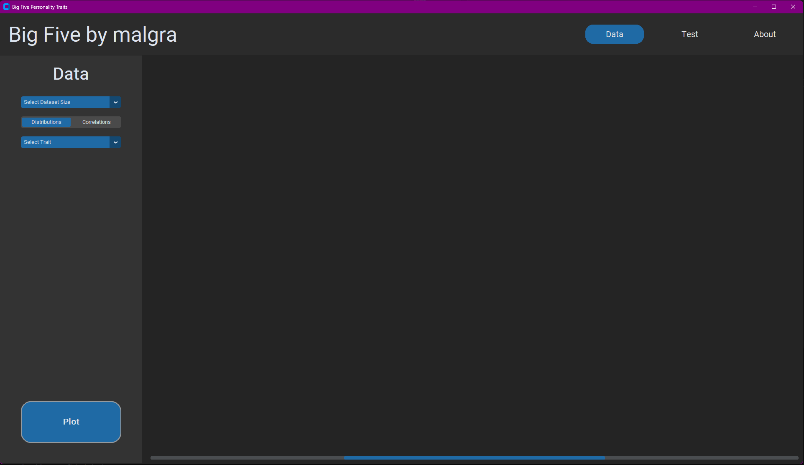
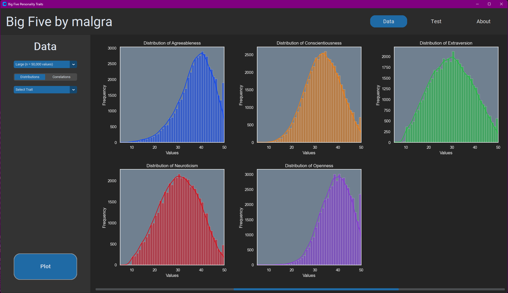

# PROJ_001_big_five
A GUI to analyse and visualise data from big five personality test results. For context on the Big Five Personality Traits, see [Wikipedia Page](https://en.wikipedia.org/wiki/Big_Five_personality_traits).

## 1. Set up and Run Program


### 1.1. Create Environment:

```
python3 -m venv venv
```

Activate environment:

-  For macOS/Linux:

    ```
    source venv/bin/activate
    ```

-  For Windows:

    ```
    source venv\Scripts\activate
    ```

-  For Visual Studio Code in Windows:

    ```
    source venv/Scripts/activate
    ```

Install dependencies:

```
pip install -r requirements.txt
```

### 1.2. Get Dataset

To get dataset, run command:
```
kaggle datasets download -d tunguz/big-five-personality-test
```

Alternatively, download manually from Kaggle via [this link](https://www.kaggle.com/datasets/tunguz/big-five-personality-test/download?datasetVersionNumber=1), and extract contents into `data/` directory.

### 1.3. Run Program
From the `PROJ_001_big_five/` directory, run:

```
python ./src/main.py
```


## 2. Program Features

Here's a run down of features, strikethrough features are implemented:

1. ~~Get and process data, sample a sub-dataset for higher process speed~~

2. Data Analysis

    2.1 ~~Distributions - basic histogram of each personality trait to view the distribution of the dataset~~

    2.2 Correlations - visualise correlations between a selected trait and the remaining 4

    2.3 Correlation heatmap - visual summary of the corelations between each one of the 5 traits with each other

3. Clustering - use basic clustering algorithms to extract major personality profiles

    3.1 Density-based algorithm (DBSCAN)

    3.2 Hierarchical-based

    3.3 K-means clustering

    3.4 Gaussian Mixture Model

    3.5 Self-organising maps

4. Take Personality Test

    4.1 Take your own personality test using the same questions asked in the dataset

    4.2 Display results as radar plot and as percentiles for each trait with respect to the dataset

5. GUI Features

    5.1 Styling and colour themes

    5.2 Menu Icons

    5.3 About page with useful context and information


## 3. Screenshots

### 3.1 Home Menu


### 3.2 Data Analysis Page
