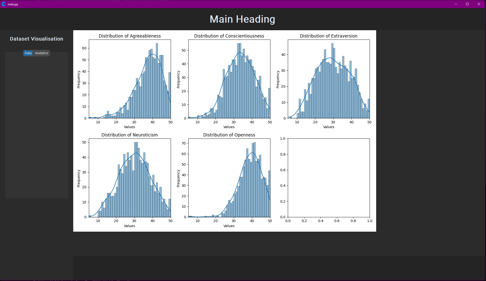

# PROJ_001_big_five
A GUI that allows you to analyse and visualise data from results of a big five personality test.

1. get data

2. read data

3. To get dataset, run command: `kaggle datasets download -d tunguz/big-five-personality-test`

Current iteration:

