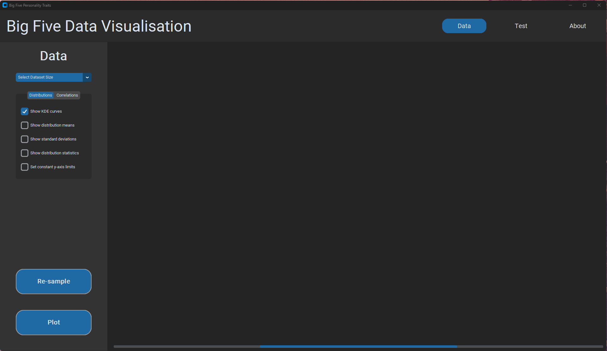
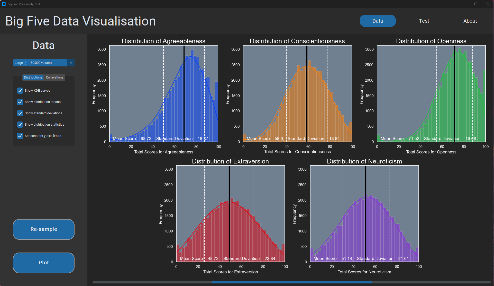
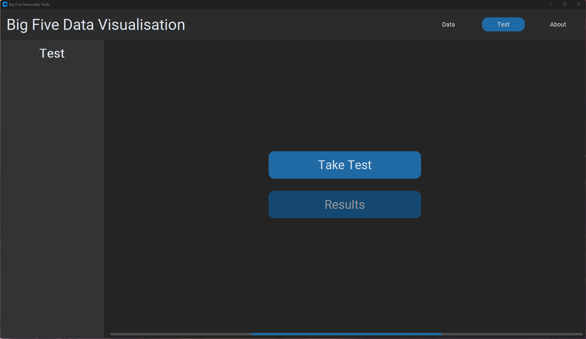

# PROJ_001_big_five
A GUI to analyse and visualise data from big five personality test results. For context on the Big Five Personality Traits, see [Wikipedia Page](https://en.wikipedia.org/wiki/Big_Five_personality_traits).

## 1. Set up and Run Program


### Install dependencies:

```
pip install -r requirements.txt
```

### Get Dataset (Optional)

The data files needed to run the program can be found in `data/`. If you would like to get the original dataset, you can [set up your Kaggle credentials](https://github.com/Kaggle/kaggle-api#api-credentials), then run command:
```
kaggle datasets download -d tunguz/big-five-personality-test -p ./data --unzip
```

Alternatively, download manually from Kaggle via [this link](https://www.kaggle.com/datasets/tunguz/big-five-personality-test/download?datasetVersionNumber=1), and extract contents into `data/` directory.

### Run Program
From the root directory, run:

```
python ./src/main.py
```


## 2. Program Features

Here's a run down of features, strikethrough features are implemented:

1. ~~Get and process data, sample a sub-dataset for higher process speed~~

2. Data Analysis

    2.1 ~~Distributions - basic histogram of each personality trait to view the distribution of the dataset~~

    2.2 ~~Correlations - visualise correlations between a selected trait and the remaining 4~~


3. Clustering - use basic clustering algorithms to extract major personality profiles

    3.1 K-means clustering

    3.2 Density-based algorithm (DBSCAN)

    3.3 Hierarchical-based

    3.4 Gaussian Mixture Model

    3.5 Self-organising maps

4. Take Personality Test

    4.1 Take your own personality test using the same questions asked in the dataset

    4.2 Visualise results each trait with respect to the dataset

5. GUI Features

    5.1 Styling and colour themes

    5.2 Menu Icons

    5.3 About page with useful context and information


## 3. Screenshots

### 3.1 Landing page on opening


### 3.2 Data Analysis Page: Trait distributions


### 3.3 Data Analysis Page: Trait correlations


### 3.4 Test Page: Opening Page
